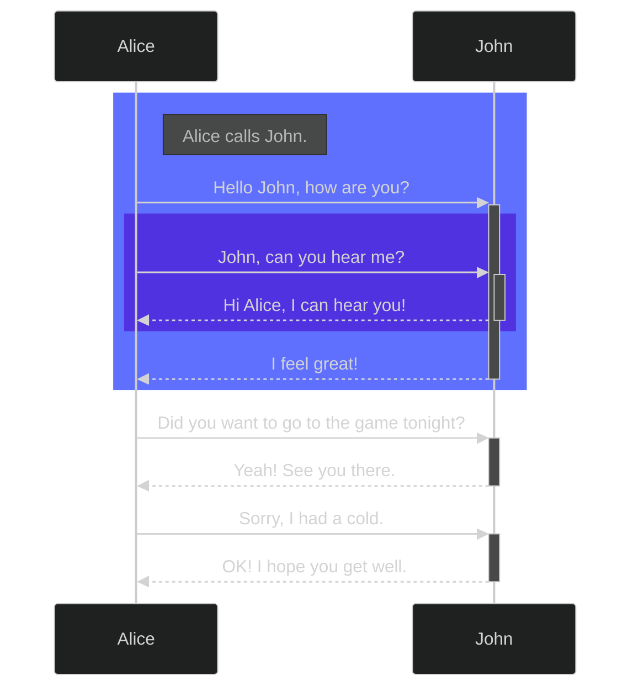

# シーケンスのサンプル

```mermaid
%%{init:{'theme':'dark'}}%%
sequenceDiagram
    participant Alice
    participant John

    rect rgb(95, 112, 255)
    note right of Alice: Alice calls John.
    Alice->>+John: Hello John, how are you?
    rect rgb(80, 50, 224)
    Alice->>+John: John, can you hear me?
    John-->>-Alice: Hi Alice, I can hear you!
    end
    John-->>-Alice: I feel great!
    end
    Alice ->>+ John: Did you want to go to the game tonight?
    John -->>- Alice: Yeah! See you there.
    Alice ->>+ John: Sorry, I had a cold.
    John -->>- Alice: OK! I hope you get well.
```
